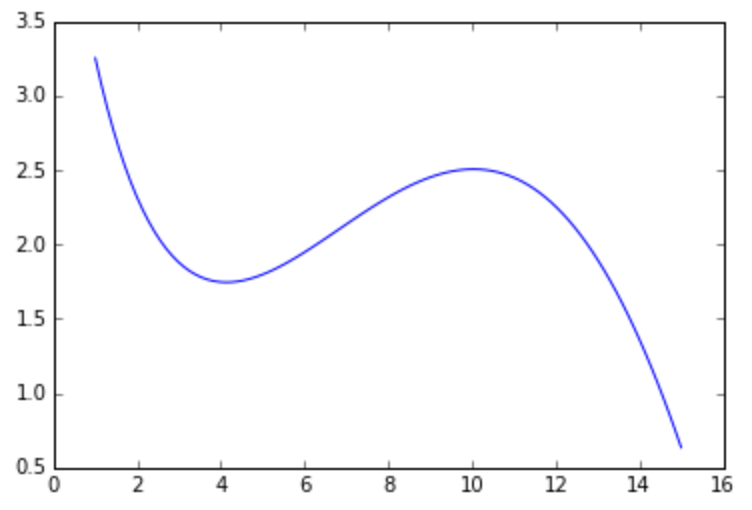

## ML and Data Analysis ##
### Course 1 - Math and Python for Data Analysis ### 

#### Week 2 #### 

#### Problem 1 - Comparison of the Sentences #### 

There is a set of sentences copied from Wikipedia. 
Each of them has 'cats' topic: 
- cats (animals) 
- UNIX-utility cat 
- versions of OS X, titled after various cat names

**The task:** to find 2 sentences that are closest in the meaning to the first one.  
Measure of proximity in the meaning: cosine distance. 

#### Problem 2 - Function approximation #### 

f(x) = sin(x / 5) * exp(x / 10) + 5 * exp(-x / 2) in the interval [1,15]  

**The tasks:** 
- approximate this function by the first, second and third degree polynomial.  
- Plot these aproxmation functions.  
- Write obtained third degree polynomial coefficients into the file.  

To find the approximating polynomial function, solve the following system of linear equations: 

